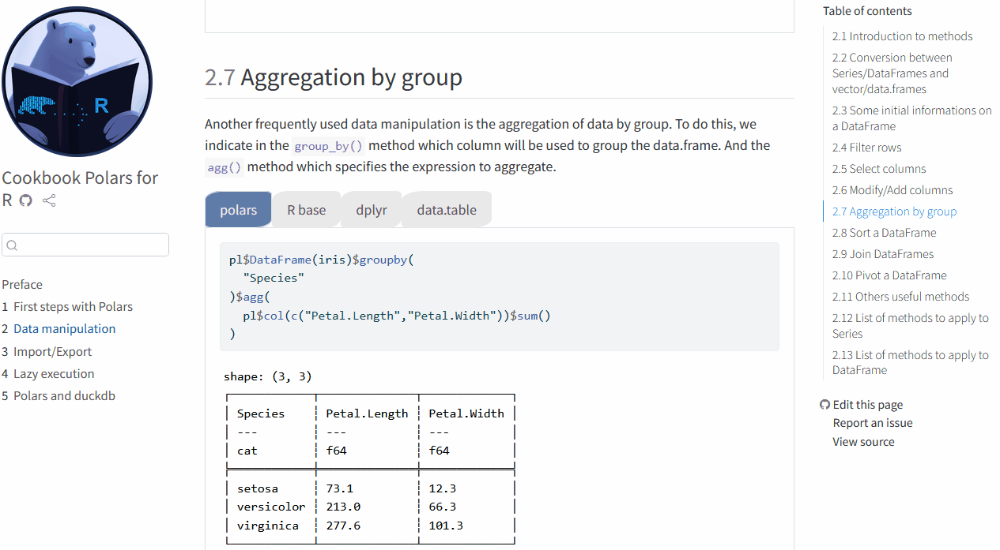

<!-- badges: start -->
[](https://github.com/ddotta/cookbook-rpolars/actions/workflows/quarto-render-publish.yml)
<!-- badges: end -->

:book: cookbook-rpolars 
======================================
The purpose of [this book](https://ddotta.github.io/cookbook-rpolars/) is to introduce some of the features of Polars with R.
It contains a side-by-side comparison between Polars, R base and the two most popular packages for data manipulation dplyr and data.table.

### Table of Contents

- [First steps](https://ddotta.github.io/cookbook-rpolars/first_steps.html)

- [Data manipulation](https://ddotta.github.io/cookbook-rpolars/data_manipulation.html)

- [Import/Export](https://ddotta.github.io/cookbook-rpolars/import_export.html)

- [Lazy execution](https://ddotta.github.io/cookbook-rpolars/lazy_execution.html)

- [Articulation with duckdb](https://ddotta.github.io/cookbook-rpolars/duckdb.html)


### Contribution

This book is free and open source, so please do [open an issue](https://github.com/ddotta/cookbook-rpolars/issues/new) or even better a PR if you notice a problem.

### How to render the book locally

If you want to render the book locally, follow these instructions in your terminal:

```
git clone https://github.com/ddotta/cookbook-rpolars.git (HTTPS)
or
git clone git@github.com:ddotta/cookbook-rpolars.git (SSH)
quarto render book/
```

### Overview of the book and equivalences between different syntaxes

